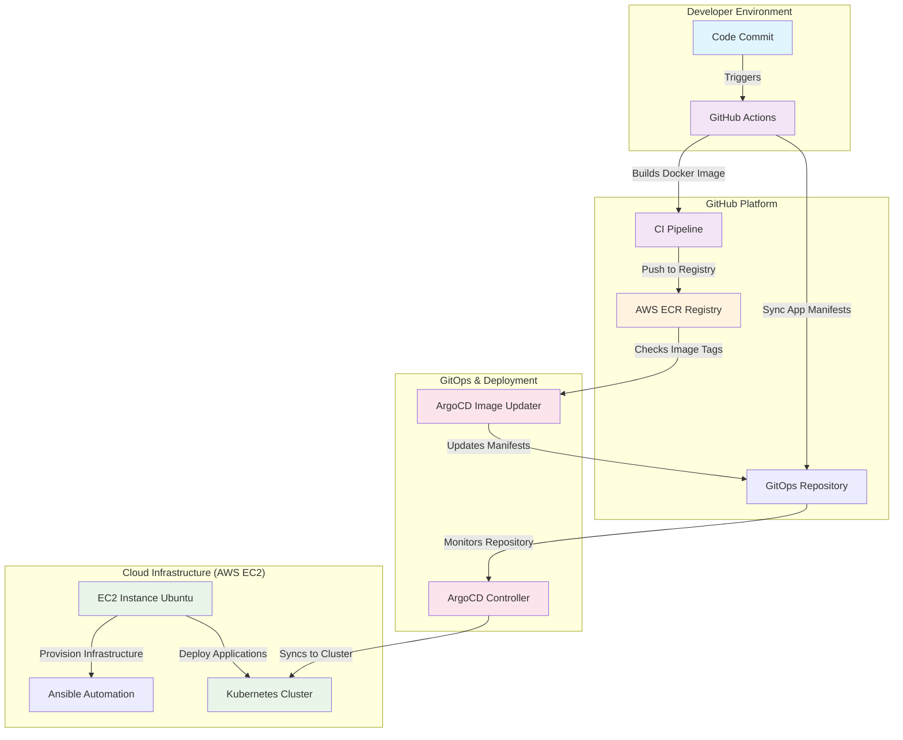
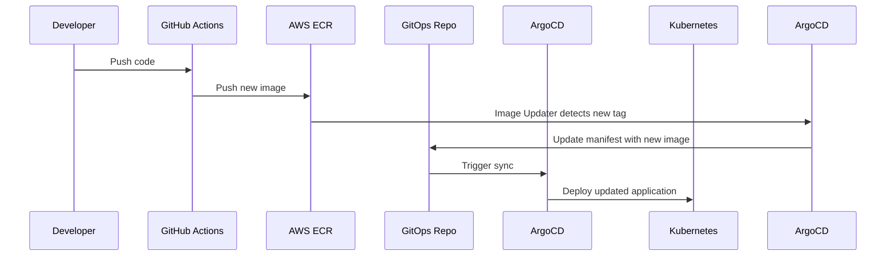

## 📋 Table of Contents

- [Overview](#overview)
- [Architecture](#architecture)
- [Prerequisites](#prerequisites)
- [Technology Stack](#technology-stack)
- [Workflow Breakdown](#workflow-breakdown)
- [Setup Instructions](#setup-instructions)
- [Security Considerations](#security-considerations)
- [Monitoring & Logging](#monitoring--logging)
- [Troubleshooting](#troubleshooting)
- [Contributing](#contributing)
- [References](#references)

## 🔍 Overview

This project demonstrates a complete **DevOps CI/CD pipeline** implementing **GitOps principles** with automated deployment to Kubernetes. The architecture leverages modern DevOps tools to achieve continuous integration, continuous deployment, and infrastructure as code.

### Key Features

- 🚀 **Automated CI** with GitHub Actions
- 🐳 **Containerized deployments** using Docker
- ☸️ **Kubernetes orchestration** for scalable deployments  
- 🔄 **GitOps workflow** with ArgoCD
- 🏗️ **Infrastructure as Code** with Ansible
- 🔐 **Secure image management** with AWS ECR
- 📊 **Automated image updates** with ArgoCD Image Updater

## ⚙️ Architecture



## 📋 Prerequisites

Before setting up this pipeline, ensure you have:

### Required Accounts & Services
- [ ] GitHub account with repository access
- [ ] AWS account with ECR and EC2 permissions


### Local Development Environment
- [ ] **Docker** (v20.10+)
- [ ] **AWS CLI** (v2.0+)
- [ ] **kubectl** (v1.24+)
- [ ] **Ansible** (v2.9+)
- [ ] **Git** (v2.30+)

### AWS IAM Permissions
```json
{
    "Version": "2012-10-17",
    "Statement": [
        {
            "Effect": "Allow",
            "Action": [
                "ecr:GetAuthorizationToken",
                "ecr:BatchCheckLayerAvailability",
                "ecr:GetDownloadUrlForLayer",
                "ecr:BatchGetImage",
                "ecr:PutImage",
                "ec2:*"
            ],
            "Resource": "*"
        }
    ]
}
```

## 🛠️ Technology Stack

| Component | Technology | Purpose | Justification |
|-----------|------------|---------|---------------|
| **Backend** | Node.js, Express.js | Application runtime | Fast, scalable JavaScript runtime |
| **Database** | MongoDB, Mongoose | Data persistence | Document-based, flexible schema |
| **Containerization** | Docker | Application packaging | Consistent environments across stages |
| **CI Platform** | GitHub Actions | Continuous Integration | Native GitHub integration, free for public repos |
| **Image Registry** | AWS ECR | Container image storage | Secure, private registry with IAM integration |
| **Infrastructure** | Ansible | Infrastructure provisioning | Agentless, declarative automation |
| **Orchestration** | Kubernetes | Container orchestration | Production-ready, scalable deployment platform |
| **GitOps** | ArgoCD | Continuous Deployment | Declarative, Git-based deployment management |
| **Auto-Updates** | ArgoCD Image Updater | Automated image updates | Seamless integration with ArgoCD |

## 🔄 Workflow Breakdown

### Phase 1: Continuous Integration (GitHub Actions)


**Key Steps:**
1. **Trigger**: Push to `main` branch
2. **Build**: Create Docker image with semantic versioning
3. **Test**: Run automated tests (unit, integration)
4. **Push**: Upload image to AWS ECR with proper tags
5. **Notify**: Update GitOps repository with new image version

### Phase 2: Infrastructure Provisioning (Ansible)

**Infrastructure Components:**
- **EC2 Instance**: Ubuntu 22.04 LTS with appropriate sizing
- **Docker Runtime**: Container execution environment
- **Kubernetes Cluster**: Single-node cluster with kubeadm
- **ArgoCD**: GitOps controller with web UI
- **Networking**: Security groups, load balancers

### Phase 3: Continuous Deployment (GitOps)



## 🚀 Setup Instructions

### Step 1: Clone and Configure Repository

```bash
# Clone the repository
git clone https://github.com/Nehad-Said/nodejs-app-devops.git
cd nodejs-app-devops

# Set up environment variables
cp .env.example .env
# Edit .env with your configuration
```

### Step 2: AWS Infrastructure Setup

```bash
# Create ECR repository
aws ecr create-repository --repository-name your-app-name

# Launch EC2 instance
aws ec2 run-instances \
  --image-id ami-0c02fb55956c7d316 \
  --instance-type t3.medium \
  --key-name your-key-pair \
  --security-group-ids sg-xxxxxxxxx
```

### Step 3: Ansible Provisioning

```bash
# Update inventory file
vi ansible-setup/inventory/hosts.yml
ansible all -i inventory/hosts.yml -m ping
# Run Ansible playbook
ansible-playbook -i inventory/hosts.yml playbooks/setup.yml
```

### Step 4: GitHub Actions Configuration

Add the following secrets to your GitHub repository:

- `AWS_ACCESS_KEY_ID`
- `AWS_SECRET_ACCESS_KEY`
- `AWS_REGION`
- `ECR_REPOSITORY_URI`

### Step 5: ArgoCD Setup

```bash
# Access ArgoCD UI
kubectl port-forward svc/argocd-server -n argocd 8080:443

# Get initial admin password
kubectl -n argocd get secret argocd-initial-admin-secret -o jsonpath="{.data.password}" | base64 -d
```

## 🔐 Security Considerations

### Secrets Management
- Store sensitive data in GitHub Secrets
- Use AWS IAM roles with least privilege principle
- Rotate credentials regularly

### Container Security
- Scan images for vulnerabilities using tools like Trivy
- Use multi-stage Docker builds to reduce attack surface
- Implement Pod Security Standards in Kubernetes
- Regular security updates for base images

### Network Security
- Use security groups with minimal required ports
- Implement network policies in Kubernetes

## 📊 Monitoring & Logging

### Recommended Tools
- **ArgoCD Notifications**: Deployment status alerts

### Key Metrics to Monitor
- Application response times
- Container resource utilization
- Deployment success/failure rates
- Security vulnerability alerts

## 🔧 Troubleshooting

### Common Issues

**Issue**: ArgoCD not syncing applications
```bash
# Check ArgoCD application status
kubectl get applications -n argocd

# View application details
argocd app get your-app-name
```

**Issue**: Image updater not detecting new images
```bash
# Check Image Updater logs
kubectl logs -n argocd deployment/argocd-image-updater
```

**Issue**: Kubernetes pods failing to start
```bash
# Check pod status and logs
kubectl describe pod <pod-name>
kubectl logs <pod-name>
```

## 🤝 Contributing

1. Fork the repository
2. Create a feature branch (`git checkout -b feature/amazing-feature`)
3. Commit your changes (`git commit -m 'Add amazing feature'`)
4. Push to the branch (`git push origin feature/amazing-feature`)
5. Open a Pull Request

## 📚 References

### Documentation
- [GitHub Actions Documentation](https://docs.github.com/en/actions)
- [Docker Best Practices](https://docs.docker.com/develop/dev-best-practices/)
- [Kubernetes Documentation](https://kubernetes.io/docs/)
- [ArgoCD Documentation](https://argo-cd.readthedocs.io/)
- [Ansible Documentation](https://docs.ansible.com/)

### Tutorials & Guides
- [Dockerizing Node.js Applications](https://nodejs.org/en/docs/guides/nodejs-docker-webapp/)
- [AWS ECR User Guide](https://docs.aws.amazon.com/ecr/)
- [GitOps with ArgoCD](https://argoproj.github.io/argo-cd/getting_started/)

### Related Projects
- [Todo-List-nodejs Original Repository](https://github.com/example/todo-list-nodejs)
- [GitOps Examples](https://github.com/argoproj/argocd-example-apps)

---

## 📄 License

This project is licensed under the MIT License - see the [LICENSE](LICENSE) file for details.

---

**Made with ❤️ by [Nehad Said]**

*For questions or support, please open an issue or contact [nehadabasit.software@gmail.com]*
